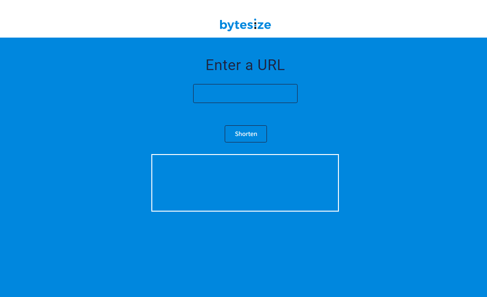

# byte-size 

In this project we can shorten our long internet links.

## Target

Using the [Rebrandly](https://www.rebrandly.com/) `API` we can shorten those addresses or links that are extremely long. Of course, from *Rebrandly* we can manage, customize and do a lot of things with our custom links. 

## Credits 

- [CodeCademy](https://www.codecademy.com/)
- [Rebrandly](https://www.rebrandly.com/)

👋🏼👋🏼